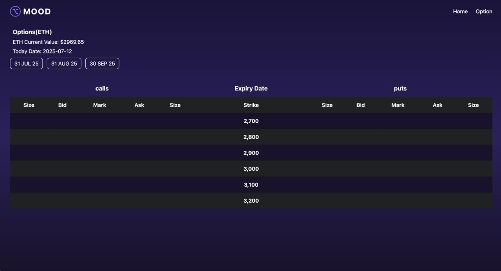
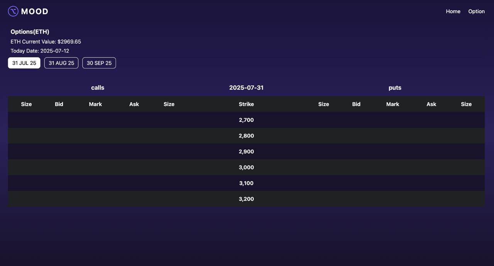
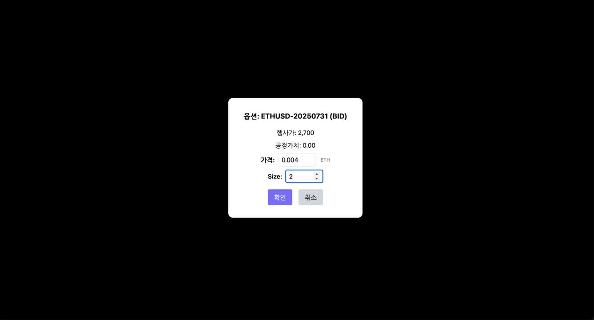

# Monad Blitz Seoul – On-Chain Options DEX

## Project Overview
Monad Blitz Seoul implements a fully on-chain European options exchange for ETH, combining Monad’s optimistic-parallel EVM with Chainlink CCIP for cross-chain data. Option pricing is executed on-chain in real time, while 24-hour realised volatility is sourced from Avalanche Fuji.

**Key Highlights**
- European call & put options on ETH, priced with Black-Scholes in 18-dec fixed-point arithmetic.
- Gas-optimised batch pricing (`priceBatch`) processing 20 options in < 200 k gas.
- Stateless volatility oracle (`VolatilityHelper.sol`) on Avalanche Fuji, queried via CCIP.
- React-based Option Matrix UI (strikes × expiries) with live fair values.
- Foundry driven build, test and deployment pipeline.

## Repository Structure
```
contracts/   Solidity source (OptionPricer, VolatilityHelper, OptionRouter)
frontend/    Next.js UI (Option Matrix, hooks, components)
scripts/     Foundry & Hardhat deployment / CCIP sender scripts
test/        Foundry unit tests & gas reports
```

## Pricing Flow
1. **Expiry tab click** → UI fetches ETH/USD spot (Chainlink) & generates `{S,K,T,isCall}` array.
2. **Volatility retrieval** → `VolatilityHelper.sol` on Avalanche returns 24 h σ.
3. **Batch valuation** → `OptionPricer.priceBatch` applies Black-Scholes to every element.
4. **Render** → UI updates the Option Matrix.

```
Frontend (Next.js) ─▶ OptionRouter (Monad) ────▶ VolatilityHelper (Fuji)
                             │                         │
                             └───┐  CCIP Msg  ◀────────┘
                                 ▼
                        OptionPricer (Monad)
```

## Quick Start
### Prerequisites
- **Foundry** ≥ 0.2.0
- **Node.js** ≥ 20 (pnpm recommended)
- AVAX & LINK test tokens on Fuji (for CCIP fees)

### Installation
```bash
git clone https://github.com/YOUR_ORG/monad-blitz-seoul.git
cd monad-blitz-seoul

# Install contract libraries
forge install --no-commit \
  prb/math \
  openzeppelin/openzeppelin-contracts \
  smartcontractkit/chainlink \
  smartcontractkit/ccip-solidity

forge build            # compile
forge test             # run unit & gas tests

cd frontend
pnpm install && pnpm dev  # launch UI on http://localhost:3000
```

### Environment variables
Create `.env` at project root:
```
MONAD_RPC_URL="https://rpc.monad-testnet.io"
AVALANCHE_RPC_URL="https://api.avax-test.network/ext/bc/C/rpc"
PRIVATE_KEY="<deployer PK>"
ETH_FEED="0x…"            # Chainlink ETH/USD feed on Monad
VOL_FEED="0x…"            # Chainlink ETH Vol feed on Fuji
```

### Deployment (Testing networks)
```bash
# 1. Deploy OptionPricer on Monad
forge script scripts/DeployOptionPricer.s.sol \
    --rpc-url $MONAD_RPC_URL --private-key $PRIVATE_KEY --broadcast

# 2. Deploy VolatilityHelper on Avalanche Fuji
forge script scripts/DeployVolatilityHelper.s.sol \
    --rpc-url $AVALANCHE_RPC_URL --private-key $PRIVATE_KEY --broadcast

# 3. Configure Router / CCIP
forge script scripts/ConfigurePricer.s.sol \
    --rpc-url $MONAD_RPC_URL --private-key $PRIVATE_KEY --broadcast
```

## Contract Specs
| Contract              | Chain   | Purpose                                           |
|-----------------------|---------|---------------------------------------------------|
| `OptionPricer.sol`    | Monad   | Pure Black-Scholes valuation (single & batch)     |
| `VolatilityHelper.sol`| Fuji    | Exposes 24 h ETH/USD realised volatility via CCIP |
| `OptionRouter.sol`    | Monad   | Combines σ + spot to feed pricer; whitelist auth  |

### Gas Benchmarks (via-IR)
| Function        | Input                     | Gas ≤ |
|-----------------|---------------------------|-------|
| priceBatch      | 20 options (10 K × 2 CP)  | 200 k |

Run `forge test --gas-report` for full data.

## Coding Standards
- Solidity 0.8.25+, **via-IR**, NatSpec-documented, minimal assembly.
- React hooks / components per feature; contract addresses injected via `NEXT_PUBLIC_*` env.
- React Query for caching; Zustand for ephemeral state.

## Contribution
1. Fork & create branch (`git checkout -b feature/<name>`)
2. Lint (`forge fmt && pnpm lint`) and test.
3. Submit a pull request.

## Usage Examples






## License
MIT

---
This repository is experimental and deployed on testnets only. **Use at your own risk.**
